# 词法分析实验报告

<center><div style='height:2mm;'></div><div style="font-size:14pt;">池纪君 2019213688 2019211301班</div></center>
<center><span style="font-size:9pt;line-height:9mm">北京邮电大学 计算机学院</span>
</center>

# 实验题目

## 实验内容

​		语法分析程序的设计与实现

## 实验要求

### 设计要求

​		编写语法分析程序，实现对算术表达式的语法分析。要求所分析算术表达式由如下文法产生。
$$
E\rightarrow E+T\space|\space E-T\space |\space T\\
T\rightarrow T*F\space|\space T/F\space |\space F\\
F\rightarrow (E)\space|\space num
$$

### 输出要求

​		在对输入的算术表达式进行分析过程中，依次出所采用产生。

### 实现方法要求

1. 编写递归调用程序实现自顶向下的分析。 
2. 编写 LL(1) 语法分析程序。 
3. 编写语法分析程序实现自底向上的分析。
4. 利用 YACC 自动生成语法分析程序，调用LEX自动生成的词法分析程序。


# 程序设计说明

## 实验环境

  1. 本实验在Windows WSL2上进行开发，其中C语言环境为 gcc (Ubuntu 9.3.0-17ubuntu1~20.04) 9.3.0 和 cmake version 3.16.3。
  2. 编译&运行命令：
          1. 方法1-3：
                  1. `cd parse`
                  2. `mkdir build && cd build`
                  3. `cmake ..`
                  4. `make && cd ..`
                  5. `./build/LL1test` 、`./build/LRtest`

          2. 方法4：
                  1. `cd yacc`
                  2. `make`
                  3. `./calc < test.p`

  3. 额外的**Linux**可执行文件：`parse/_exe/*`、`yacc/calc`

​     

## 文法的存储和相关算法的设计与实现

### 文法类的设计

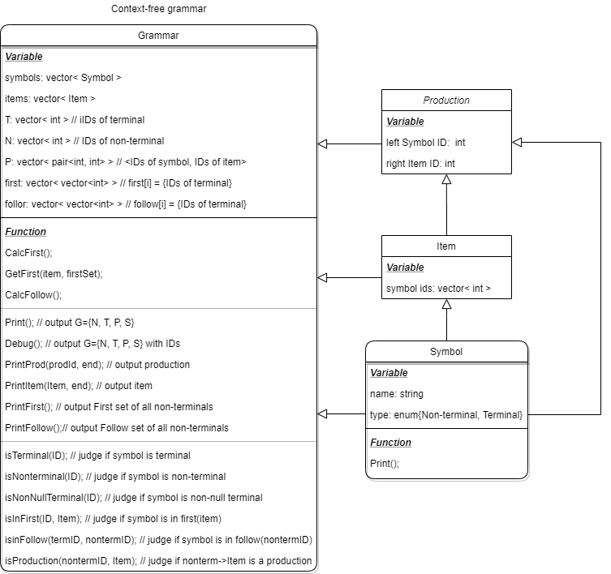


### 消除左递归

1. 问题：消除左递归的目的是为了防止在递归下降分析和LL分析的过程中产生无穷递归的死循环问题。

2. 算法：对文法$G=\left(\mathbf{V}_{\mathrm{T}}, \mathbf{V}_{\mathrm{N}}, \mathbf{S}, \varphi\right)$，可以用如下算法消除左递归：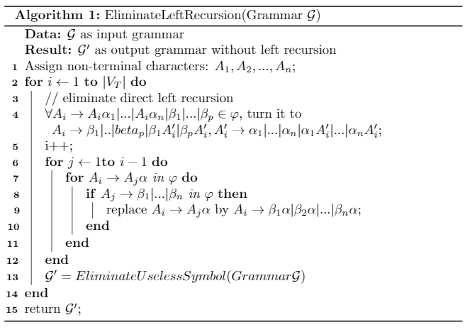


### 提取左公因子

1. 问题：提取左部公因子的目的是为了使得LL(1)的每个非终结符（包括新产生的非终结符）的所有候选式首部符号两两不相交。		

2. 算法：

   * 如有产生式 $\mathrm{A} \rightarrow \alpha \beta_{1} \mid \alpha \beta_{2}$ 提取左公因子 $\alpha$, 则原产生式变为：$\begin{aligned}
     &\mathbf{A} \rightarrow \alpha \mathbf{A}^{\prime} \\
     &\mathbf{A}^{\prime} \rightarrow \beta_{1} \mid \beta_{2}
     \end{aligned}$

   * 若有产生式 $\mathrm{A} \rightarrow \alpha \beta_{1}\left|\alpha \beta_{2}\right| \ldots\left|\alpha \beta_{\mathrm{n}}\right| \gamma$ 可用如下的产生式代替：$\begin{aligned}
     &\mathbf{A} \rightarrow \alpha \mathbf{A}^{\prime} \mid \gamma \\
     &\mathbf{A}^{\prime} \rightarrow \beta_{1}\left|\beta_{2}\right| \ldots \mid \beta_{\mathrm{n}}
     \end{aligned}$

### 计算 $\operatorname{FIRST}$ 集合

#### 定义

​		$\operatorname{FIRST}\left(\alpha_{i}\right)=\left\{a \mid \alpha_{i} \stackrel{*}{\Rightarrow} a \beta, a \in V_{\mathrm{T}}, \alpha_{i}, \beta \in\left(V_{\mathrm{T}} \cup V_{\mathrm{N}}\right)^{*}\right\}$ ，表示可由$\alpha_i$推导出的所有开头终结符号的集合。特别地，如果 $\alpha_{i} \stackrel{*}{\Rightarrow} \varepsilon$, 则规定 $\varepsilon \in \operatorname{FIRST}\left(\alpha_{i}\right)$ 。

#### 算法：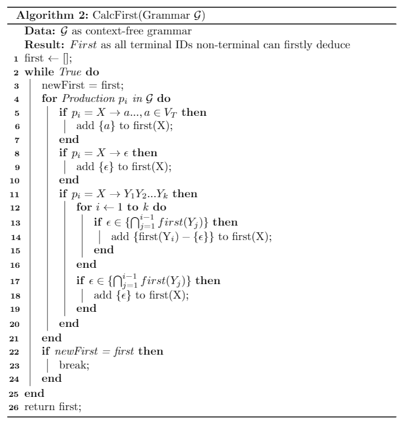

#### 计算结果

​		计算样例文法的$\operatorname{First}$集，调用`Grammar.PrintFirst()`

```c++
First:
        E: ( num 
        T: ( num 
        F: ( num
```


### 计算Follow集合

1. 定义：$\text { FOLLOW }(A)=\left\{a \mid S \stackrel{*}{\Rightarrow} \cdots A a \cdots, a \in V_{\mathrm{T}}\right\}$，表示该文法的所有句型中紧跟在$A$后的出现的终结符号或$\$$组成的集合。特别地, 若 $S \stackrel{*}{\Rightarrow} \cdots A$, 则规定 $\$ \in \mathrm{FOLLOW}(A)$，$ 为输入符号串的右结尾标志符。
2. 算法：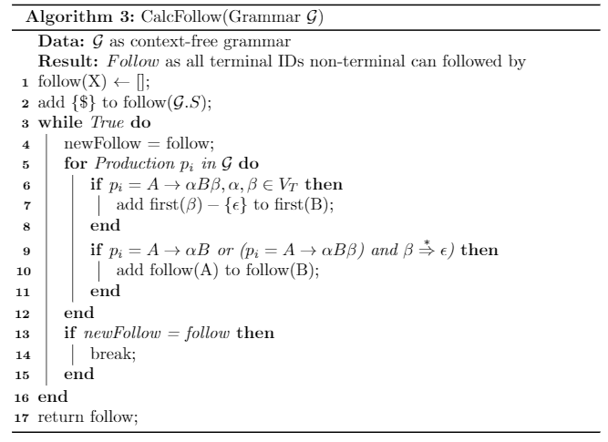

#### 计算结果

​		计算样例文法的$\operatorname{Follow}$，调用`Grammar.PrintFollow()`

```c++
Follow:
        E: $ + - ) 
        T: $ + - * / ) 
        F: $ + - * / )
```


### 构造拓广文法

#### 定义

​		对任何文法 $G=\left(\mathbf{V}_{\mathrm{T}}, \mathbf{V}_{\mathrm{N}}, \mathbf{S}, \varphi\right)$，都有等价的文法: $\mathbf{G}^{\prime}=\left(\mathbf{V}_{\mathrm{T}}, \mathbf{V}_{\mathbf{N}} \cup\left\{\mathbf{S}^{\prime}\right\}, \mathbf{S}^{\prime}, \varphi \cup\left\{\mathbf{S}^{\prime} \rightarrow \mathbf{S}\right\}\right)$ 称 $G^{\prime}$ 为 $G$ 的拓广文法。拓广文法 $G^{\prime}$ 的接受项目是唯一的 $\left(\right.$ 即 $\left.S^{\prime} \rightarrow S^{\bullet}\right)$。

#### 计算结果

​		计算样例文法的拓广文法，调用`LRParser.GetExtG()`

```
Grammar outline: 
Symbols:
         id: 0 1, $ Terminal
         id: 1 2, ε Terminal
         id: 2 1, + Terminal
         id: 3 1, - Terminal
         id: 4 1, * Terminal
         id: 5 1, / Terminal
         id: 6 1, ( Terminal
         id: 7 1, ) Terminal
         id: 8 3, num Terminal
         id: 9 1, E Nonterminal
         id: 10 1, T Nonterminal
         id: 11 1, F Nonterminal
         id: 12 2, S' Nonterminal START
Productions:
         id: 0, E ->E+T
         id: 1, E ->E-T
         id: 2, E ->T
         id: 3, T ->T*F
         id: 4, T ->T/F
         id: 5, T ->F
         id: 6, F ->(E)
         id: 7, F ->num
         id: 8, S' ->E
```


## 递归调用分析程序的设计与实现

### 递归下降分析

#### 定义及工作过程

​		从文法的开始符号出发，进行推导，试图推出要分析的输入串的过程。对给定的输入符号串，从对应于文法开始符号的根结点出发，自顶向下地为输入串建立一棵分析树。
	试探过程，反复使用不同产生式谋求匹配输入符号串。

#### 文法要求

1. 不含左递归
2. $\forall A\rightarrow \alpha_1|\alpha_2|...|\alpha_n,\space First(\alpha_i)\cap First(\alpha_j)=\Phi(i\ne j)$

### 预测分析程序构造

1. 构造转换图

   ​		在一个非终结符号A上的转移意味着对相应A的过程的调用。在一个终结符号a上的转移，意味着下一个输入符号若为a，则应做此转移。本次实验文法的各非中介符号构造转换图如下：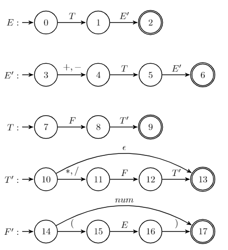

2. 转换图化简

   将转换图进行带入化简，简化图如下：

   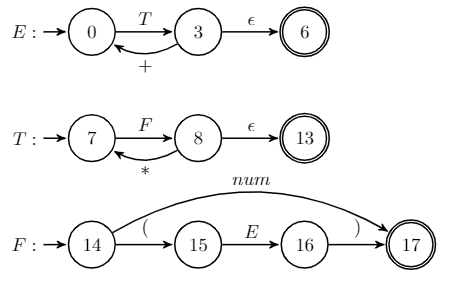

3. 分析程序的实现

   将递归分析程序存为RecurParser类，并将上图转换图封装成函数 `ProcE()`，`ProcF()`，`ProcT()`。分析程序收到词法分析结果串后，调用`Analysis()`开始递归分析。若成功，则会输出`Accept`，否则输出`Error`，并告知错误位置。

   ```c++
   class RecurParser {
     typedef vector<int> Item;
    public:
     Grammar gram;
     RecurParser(Grammar gm) : gram(gm) {}
     RecurParser() {}
     bool Analysis(Item inp);
   
    private:
     Item input;
     Symbol nowS;
     int pos;
     inline void Error() {
       printf("error at position %d : ", pos);
       nowS.print("\n");
       exit(0);
     }
     void ProcE();
     void ProcF();
     void ProcT();
     inline void fp() { nowS = gram.symbols[input[pos++]]; }
   };
   
   ```


## LL(1) 语法分析程序的设计与实现

### LL(1)文法

#### 定义

* 如果一个文法的预测分析表M不含多重定义的表项，则称该文法为LL(1)文法。
* LL(1)的含义：
  第一个L表示从左至右扫描输入符号串。第二个L表示生成输入串的一个最左推导。1表示在决定分析程序的每步动作时，向前看一个符号。

#### 判断方法

1. 一个文法是LL(1)文法，当且仅当它的每一个产生式$A\rightarrow\alpha$，满足：$\operatorname{First}(\alpha)\cap\operatorname{\beta}=\phi$，并且若$\beta$推导出$\epsilon$，则$\operatorname{Follow}(A)=\phi$。
2. 如果利用算法4.2构造出的分析表中不含多重定义的表项，则文法是LL(1)文法。

#### 预测分析表的构造算法

1. 错误处理：

   * 对于$A \in \mathbf{V}_{\mathrm{N}}, \space b \in \operatorname{FOLLOW}(A)$，若M[A,b]为空, 则加入“synch”。

   * 在使用带有同步化信息的分析表时，当前读入a，状态为A。若M[A, a]为空，则跳过a；若M[A, a]为synch，则弹出A。

2. 算法

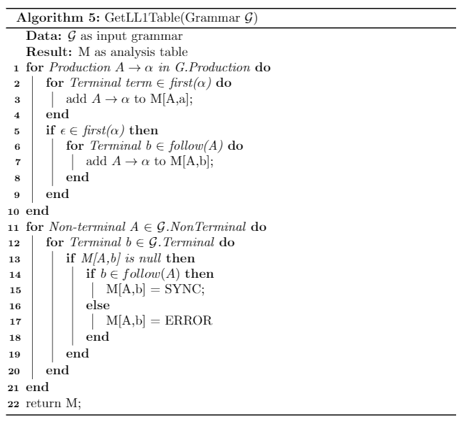


### LL(1)非递归预测分析

#### 预测分析分析程序模型及工作流程

1. 程序组成部分：
   1. 输入缓冲区：存放被分析的输入符号串，串后随右尾标志符。
   2. 符号栈：存放一系列文法符号，存于栈底。分析开始时，先将$入栈，以标识栈底，然后再将文法的开始符号入栈。
   3. 分析表：二维数组$M[A, a]$，$A\in V_N$，$a\in V_T\cup\{\$\}$。根据给定的A和a，在分析表M中找到将被调用的产生式。
   4. 输出流：分析过程中不断产生的产生式序列。
2. 工作流程：
3. 根据栈顶符号X和当前输入符号a， 分析动作有4种可能：
   (1) $X=a=\$$，宣告分析成功，停止分析；
   (2) $X=a\ne\$$，从栈顶弹出X，输入指针前移一个位置；
   (3) $X\in V_T$，但$X\ne a$，报告发现错误，调用错误处理程序， 报告错误及进行错误恢复；
   (4) 若$X\in V_N$ ，访问分析表$M[X, a]$
   1. $M[X, a]=XY_1Y_2…Y_n$，先将X从栈顶弹出，然后把产生式的右部符号串按反序 推入栈中（即按$Y_n, …,Y_2,Y_1的顺序）；
   2. $M[X, a]=X\rightarrow\epsilon$从栈顶弹出X；
   3. $M[X, a]=ERROR$调用出错处理程序，（恢复：$M[X,a]=sync$弹出栈顶A，否则跳过a）

#### 算法

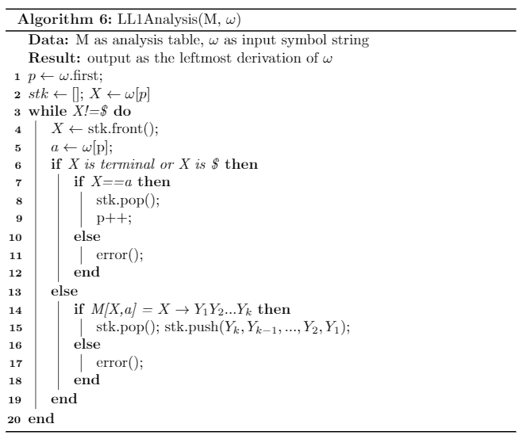

#### 类设计

```c++
class LL1Parser : public Parser {
  typedef vector<int> Item;

 private:
  // id of Nonterminal, Terminal and production
  map<pair<int, int>, int> LL1Table;
  
  void PrintStack(stack<int>& stk, const char* end);
  void PrintVec(vector<int>& vec, int start, const char* end);

 public:
  static const int ERROR = -2;
  static const int SYNC = -1;
  LL1Parser(Grammar gm) : Parser(gm){};
  bool GetLL1Table();  // return false means conflict
  void PrintTable();
  
  // conduct a LL(1) analysis
  bool LL1Analysis(Item input);
};

```


## 自底向上分析的语法分析程序的设计与实现

### LR(1)分析技术

#### 定义

1. LR(k)的含义：
   L 表示自左至右扫描输入符号串
   R 表示为输入符号串构造一个最右推导的逆过程
   k 表示为作出分析决定而向前看的输入符号的个数

2. LR分析方法的基本思想

   ​		记住已经移进和归约出的整个符号串--历史信息；
   	根据所用的产生式推测未来可能遇到的输入符号--预测信息；

   ​		根据“历史信息”和“预测信息”，以及“现实”的输入符号，确定栈顶的符号串是否构成相对于某一产生式的句柄。

#### 工作模型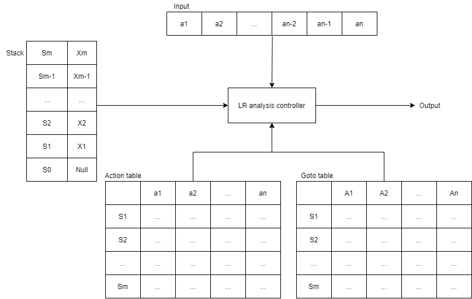


### SLR(1)分析表的构造

#### LR(0)有效项目

1. LR(0)项目
   1. 定义：右部某个位置上标有圆点的产生式称为文法G的一个LR(0)项目，例如：$A\rightarrow \cdot XYZ$，$A\rightarrow X\cdot YZ$，$A\rightarrow XY\cdot Z$，$A\rightarrow XYZ\cdot$
   2. 类别：
      1. 归约项目：圆点在产生式最右端的LR(0)项目
      2. 接受项目：对文法开始符号的归约项目
      3. 待约项目：圆点后第一个符号为非终结符号的LR(0)项目
      4. 移进项目：圆点后第一个符号为终结符号的LR(0)项目
2. LR(0)有效项目
   1. 定义：项目$A\rightarrow\beta_1\cdot\beta_2$对活前缀$\gamma=\alpha\beta$是有效的，如果存在一个规范推导：$\mathrm{S} \stackrel{*}{\Rightarrow} \alpha A \omega \Rightarrow \alpha \beta_{1} \beta_{2} \omega$。LR(0)项目$S'\rightarrow\cdot S$是活前缀$\epsilon$的有效项目。
   2. LR(0)有效项目集：文法G的某个活前缀的所有LR(0)有效项目组成的集合。
   3. LR(0)项目集规范族：文法G的所有LR(0)有效项目集组成的集合。

#### SLR(1)分析方法

1. 构造 SLR(1)分析表的基本思想是：首先为给定文法构造一个识别它的所有活前缀的确定的有限自动机,然后根据此有限自动机构造该文法的分析表。

2. SLR(1)的特点：可以通过考察follow集合解决冲突。

   1. 冲突：$I=\{X\rightarrow\alpha\cdot b\beta，A\rightarrow\alpha\cdot，B\rightarrow\beta\cdot\}$ 存在移进-归约冲突和归约-归约冲突。
   2. 解决：对于当前读入a，查看FOLLOW(A)和FOLLOW(B)。（要求：FOLLOW(A)$\cap$FOLLOW(B)=$\Phi$， $b \notin\operatorname{FOLLOW}(A)$ 并且 $b \notin\operatorname{FOLLOW}(B)$ 
      1. 当$a=b$时，把b移进栈里；
      2. 当$a\in FOLLOW(A)$时，用产生式$A\rightarrow\alpha$进行归约；
      3. 当$a\in FOLLOW(B)$时，用产生式$B\rightarrow\alpha$进行归约。

3. 构造SLR(1)分析表

   1. 闭包closure(I)：

      设I是文法G的一个LR(0)项目集合，closure(I)是从I 出发，用下面的方法构造的项目集：

      1. I中的每一个项目都属于closure(I)；
      2. 若项目$A\rightarrow\codt B\beta$属于closure(I)，且G有产生式 $B\rightarrow\eta$，若$B\rightarrow\cdot\eta$不属于closure(I)，则将$B\rightarrow\cdot\eta$ 加入 closure(I)；
      3. 重复规则 ii ，直到closure(I)不再增大为止。

   2. 转移函数go：
      若I是文法G的一个LR(0)项目集，X是一个文法符号，定义$go(I, X)=closure(J)$，其中$\mathbf{J}=\{\mathbf{A} \rightarrow \alpha \mathbf{X} \cdot \beta \mid \text { 当 } \mathbf{A} \rightarrow \alpha \cdot \mathbf{X} \beta \text { 属于 I 时 }\}$。$go(I,X)$为转移函数，项目$A\rightarrow\alpha X\cdot\beta$称为$A\rightarrow\cdot X\beta$的后续。

      

#### 算法

1. 文法的LR(0)项目集规范族的构造算法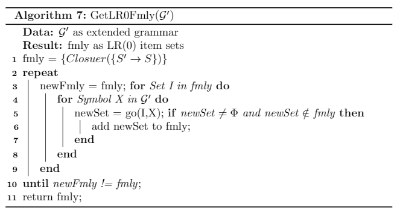

2. 求解闭包Closure算法

   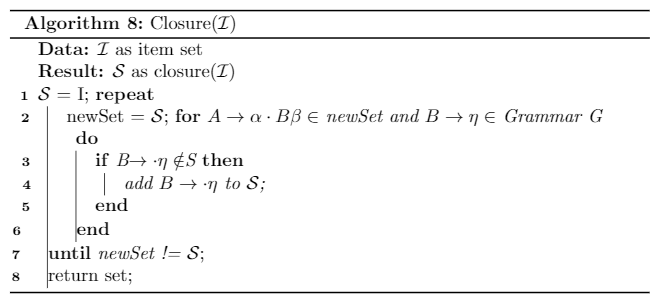

3. SLR(1)分析表的构造算法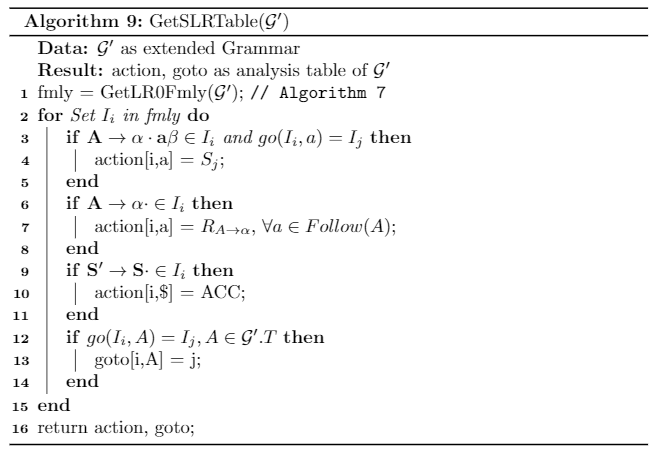

   

### LR分析控制程序

#### 算法设计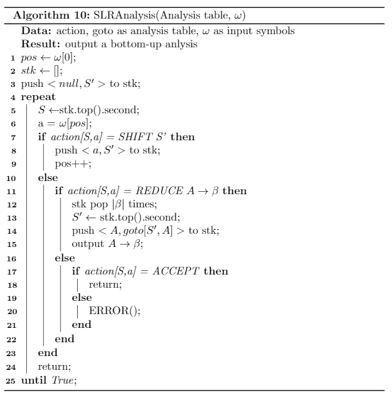

#### 类设计

```c++
class LRParser : public Parser {
  typedef vector<int> Item;
  typedef pair<int, Item> LR0Item;  // LR(0) item: id of nonterminal, Item
  typedef vector<LR0Item> LR0Set;   // LR(0) item set
  typedef vector<LR0Set> LR0Fmly;   // LR(0) item set specification family

  const int DOT_ID = -1;

 private:
  bool isExt;

 public:
  enum ActionType { SHIFT, REDUCE, ACCEPT, ERROR } actionType;
  Grammar extGram;

 private:
  LR0Fmly lR0Fmly;

  // <state id, nonterminal id> -> next state id
  map<pair<int, int>, int> gotoTable;

  // <state id, terminal id> -> <action type, action code>
  map<pair<int, int>, pair<ActionType, int>> actionTable;

  // get extended grammar
  void GetExtG();

  // closure{nowItem} => nowSet
  void GetClosure(LR0Item item, LR0Set& set);
  
  // go(set, x) => newSet
  void GetGo(LR0Set nowSet, int x, LR0Set& newSet);
  
  void PrintLR0Item(const LR0Item& lR0Item, const char* end);
  void PrintLR0Set(const LR0Set& lR0Set, const char* end);
  
  // print LR(0) set family and DFA
  void PrintLR0Fmly();
  
  void PrintStk(vector<pair<int, int>>& stk, const char* c);

 public:
  LRParser(Grammar gm) : Parser(gm) {
    isExt = false;
    GetExtG();
  };
  ~LRParser(){};
  
  // Get SLR(1) analysis table
  void GetSLRTable();
  
  void PrintLRTable();
  
  // conduct a SLR(1) analysis
  bool SLRAnalysis(Item input);
};

```


## YACC自动生成语法分析程序

### YACC简介

- yacc(Yet Another Compiler Compiler)，是Unix/Linux上一个用来生成编译器的编译器（编译器代码生成器）.
   使用巴克斯范式(BNF)定义语法，能处理上下文无关文法(context-free)。出现在每个产生式左边(left-hand side：lhs)的符号是非终端符号，出现在产生式右边(right-hand side：rhs)的符号有非终端符号和终端符号，但终端符号只出现在右端。
- yacc是开发编译器的一个有用的工具,采用LR（1）（实际上是LALR(1)）语法分析方法。这种方法具有分析速度快，能准确，即使地指出出错的位置，它的主要缺点是对于一个使用语言文法的分析器的构造工作量相当大，k愈大构造愈复杂，实现比较困难。

### Yacc工作流程与和词法分析程序Lex间的通信

* Lex和Yacc的工作关系可以看作一个生产者-消费者模型。Lex对文件字符串进行解析，将解析到的符号通过`yylex()`函数传给Yacc程序，再由Yacc程序依次对收到的符号进行LR语法分析。
* 一个由 Yacc 生成的解析器调用 `yylex()` 函数来获得标记，只有在文件结束或者出现错误标记时才会终止。 `yylex()` 可以由 Lex 来生成或完全由自己来编写。 对于由 Lex 生成的 lexer 来说，要和 Yacc 结合使用，每当 Lex 中匹配一个模式时，都必须返回一个标记。 因此 Lex 中匹配模式时的动作一般格式为：`{pattern} { /* do something */ return TOKEN_NAME; }`，Yacc获得返回的标记，进行下一步的LR语法归约。当 Yacc 编译一个带有 -d 标记的 *.y*文件时，会生成一个`y.tab.h`的头文件，它对每个终结符标记进行 `#define` 定义。 Lex 和 Yacc 一起使用的话，Lex 文件`.lex`必须在C声明段中包括`y.tab.h`。

### Yacc的规则

1. Yacc文法说明文件可以分为三个段：

   ```tex
   [第一部分：定义段]
    %%
    第二部分：规则段
    %%
    [第三部分：辅助函数段]
   ```

   1. 定义段可以分为两部分：

      1. 第一部分以符号%{和%}包裹，里面为以C语法写的一些定义和声明：例如，文件包含，宏定义，全局变量定义，函数声明等。
      2. 第二部分主要是对文法的终结符和非终结符做一些相关声明。这些声明主要有如下一些：%token，%left，%right，%nonassoc，%union，%type，%start。下面分别说明它们的用法。

   2. 规则段实际上定义了文法的非终结符及产生式集合，以及当归约整个产生式时应执行的操作。

      ​		假如产生式为expr ® expr plus term | term，则在规则段应该写成：

      ```c++
      expr: expr PLUS term       {语义动作}
      	| term                   {语义动作}
      	;
      ```

   3. 辅助函数段用C语言语法来写，辅助函数一般指在规则段中用到或者在语法分析器的其他部分用到的函数。这一部分一般会被直接拷贝到yacc编译器产生的c源文件中。一般来说，除规则段用到的函数外，辅助函数段一般包括如下一些例程：yylex()，yyerror()，main()。

2. Yacc文件的使用

   1. 生成y.tab.c。

      ​		`bison --yacc -d -v filename.y` 其中`-d`表示生成名为filename.tab.h的头文件，`-v`表示生成filename.output文件，该文件说明了该语法分析器使用的识别活前缀的DFA。

   2. 与lex联合编译

      ​		`flex filename.l` 将lex源文件编译成.c的文件格式，`gcc -o example y.tab.c lex.yy.c` 将lex和yacc代码共同编译生成`example`的可执行程序。（注：在`filemae.l`中应包含`y.tab.h`的头文件）

   3. 使用`makefile`简化编译过程：详见`makefile`文件。

   4. 进行语法分析

      ​		`./example < test.p` 即可将样例文件进行语法分析。

### Yacc程序实现

1. calc.l
   * 对数字和符号进行词法解析
   * 提供`getNum()`函数，为语法分析提供解析到的数的值
2. calc.y
   * 对接受的符号进行语法归约
   * 在不同产生式的语义动作中，进行表达式的值的计算，并按照归约顺序输出归约使用的产生式。
   * 输出表达式的值
   * 在`yyerror()`中提供错误处理


# 测试报告

## 测试程序说明

1. lex：测试样例文法读取，存储，输出和词法分析正确性。文法文件：`data/grammar.in`，分析文件`data/expression.in`。
2. Rectest：测试递归下降分析程序正确性，输出分析结果。
3. LL1test：测试用LL(1)文法进行预测分析的正确性，输出预测分析表，分析过程和分析结果。
4. LRtest：测试拓广文法正确性，输出拓广文法。测试SLR(1)文法进行语法分析的正确性，输出识别活前缀的项目集规范族DFA，预测分析表action和goto，输出LR分析过程和分析结果。
5. LL1synthesis：综合词法程序lex和LL语法分析程序，输出对文件`data/expression.in`的分析过程。
6. LRsynthesis：综合词法程序lex和LR语法分析程序，输出对文件`data/expression.in`的分析过程。


## 测试结果与说明

1. 数据文件：

   1. expression.in

      ```tex
      (3.090+878*24.345)*.013445
      ```

   2. grammar.in

      ```tex
      Terminal: 
          + - * / ( ) num
      
      Nonterminal:
          E T F
      
      Production:
          E -> E+T
          E -> E-T
          E -> T
          T -> T*F
          T -> T/F
          T -> F
          F -> (E)
          F -> num
      
      Start:
          E
      ```

   3. grammar3.in（为grammar.in消去左递归）

      ```tex
      Terminal: 
          + - * / ( ) num
      
      Nonterminal:
          E T F E' T'
      
      Production:
          E -> TE'
          E' -> +TE'
          E' -> -TE'
          E' -> ε
          T -> FT'
          T' -> *FT'
          T' -> /FT'
          T' -> ε
          F -> (E)
          F -> num
      
      Start:
          E
      ```

2. 测试结果：

   1. lex

      ```bash
      fschi@FCXiaoXin:/mnt/v/Code/exp_compile/2_yacc/parse$ ./build/lex
      
      Grammar info: 
      Terminal character:
              $ ε + - * / ( ) num 
      Nonterminal character:
              E T F 
      Production:
              E -> E+T
              E -> E-T
              E -> T
              T -> T*F
              T -> T/F
              T -> F
              F -> (E)
              F -> num
      Start caracter: E
      
      Grammar outline: 
      Symbols:
               id: 0 1, $ Terminal
               id: 1 2, ε Terminal
               id: 2 1, + Terminal
               id: 3 1, - Terminal
               id: 4 1, * Terminal
               id: 5 1, / Terminal
               id: 6 1, ( Terminal
               id: 7 1, ) Terminal
               id: 8 3, num Terminal
               id: 9 1, E Nonterminal START
               id: 10 1, T Nonterminal
               id: 11 1, F Nonterminal
      Productions:
               id: 0, E ->E+T
               id: 1, E ->E-T
               id: 2, E ->T
               id: 3, T ->T*F
               id: 4, T ->T/F
               id: 5, T ->F
               id: 6, F ->(E)
               id: 7, F ->num
      Input file: data/expression.in
      6 8 2 8 4 8 7 4 8
      ```

   2. Rectest

      ```bash
      fschi@FCXiaoXin:/mnt/v/Code/exp_compile/2_yacc/parse$ ./build/Rectest
      
      Grammar info: 
      Terminal character:
              $ ε + - * / ( ) num 
      Nonterminal character:
              E T F 
      Production:
              E -> E+T
              E -> E-T
              E -> T
              T -> T*F
              T -> T/F
              T -> F
              F -> (E)
              F -> num
      Start caracter: E
      
      Grammar outline: 
      Symbols:
               id: 0 1, $ Terminal
               id: 1 2, ε Terminal
               id: 2 1, + Terminal
               id: 3 1, - Terminal
               id: 4 1, * Terminal
               id: 5 1, / Terminal
               id: 6 1, ( Terminal
               id: 7 1, ) Terminal
               id: 8 3, num Terminal
               id: 9 1, E Nonterminal START
               id: 10 1, T Nonterminal
               id: 11 1, F Nonterminal
      Productions:
               id: 0, E ->E+T
               id: 1, E ->E-T
               id: 2, E ->T
               id: 3, T ->T*F
               id: 4, T ->T/F
               id: 5, T ->F
               id: 6, F ->(E)
               id: 7, F ->num
      Accept!
      ```

   3. LL1test

      LL(1)分析表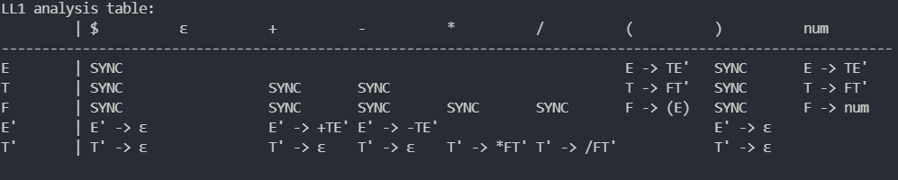

      测试结果：

      ```bash
      fschi@FCXiaoXin:/mnt/v/Code/exp_compile/2_yacc/parse$ ./build/LL1test 
      
      LL1 analysis table:
               | $          ε          +          -          *          /          (          )          num        
      --------------------------------------------------------------------------------------------------------------
      E        | SYNC                                                              E -> TE'   SYNC       E -> TE'   
      T        | SYNC                  SYNC       SYNC                             T -> FT'   SYNC       T -> FT'   
      F        | SYNC                  SYNC       SYNC       SYNC       SYNC       F -> (E)   SYNC       F -> num   
      E'       | E' -> ε               E' -> +TE' E' -> -TE'                                  E' -> ε               
      T'       | T' -> ε               T' -> ε    T' -> ε    T' -> *FT' T' -> /FT'            T' -> ε               
      
      
      Start nonrecursive analysis.
      Stack: E $      Input: ( num + num ) * num $    Output: E -> T E' 
      Stack: T E' $   Input: ( num + num ) * num $    Output: T -> F T' 
      Stack: F T' E' $        Input: ( num + num ) * num $    Output: F -> ( E ) 
      Stack: ( E ) T' E' $    Input: ( num + num ) * num $    eliminate (
      Stack: E ) T' E' $      Input: num + num ) * num $      Output: E -> T E' 
      Stack: T E' ) T' E' $   Input: num + num ) * num $      Output: T -> F T' 
      Stack: F T' E' ) T' E' $        Input: num + num ) * num $      Output: F -> num 
      Stack: num T' E' ) T' E' $      Input: num + num ) * num $      eliminate num
      Stack: T' E' ) T' E' $  Input: + num ) * num $  Output: T' -> ε 
      Stack: E' ) T' E' $     Input: + num ) * num $  Output: E' -> + T E' 
      Stack: + T E' ) T' E' $         Input: + num ) * num $  eliminate +
      Stack: T E' ) T' E' $   Input: num ) * num $    Output: T -> F T' 
      Stack: F T' E' ) T' E' $        Input: num ) * num $    Output: F -> num 
      Stack: num T' E' ) T' E' $      Input: num ) * num $    eliminate num
      Stack: T' E' ) T' E' $  Input: ) * num $        Output: T' -> ε 
      Stack: E' ) T' E' $     Input: ) * num $        Output: E' -> ε 
      Stack: ) T' E' $        Input: ) * num $        eliminate )
      Stack: T' E' $  Input: * num $  Output: T' -> * F T' 
      Stack: * F T' E' $      Input: * num $  eliminate *
      Stack: F T' E' $        Input: num $    Output: F -> num 
      Stack: num T' E' $      Input: num $    eliminate num
      Stack: T' E' $  Input: $        Output: T' -> ε 
      Stack: E' $     Input: $        Output: E' -> ε 
      Stack: $        Input: $        eliminate $
      Analysis succeed.
      ```

      

   4. LRtest

      LR(0)项目集规范族：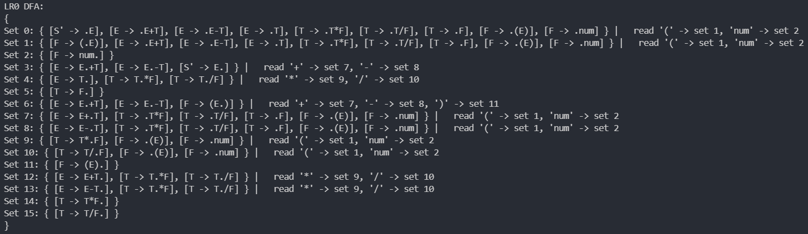

      SLR(1)分析表：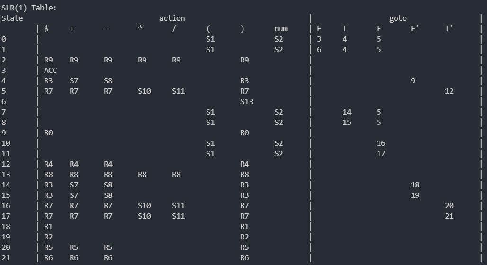

      测试结果：

      ```bash
      fschi@FCXiaoXin:/mnt/v/Code/exp_compile/2_yacc/parse$ ./build/LRtest 
      
      Grammar info: 
      Terminal character:
              $ ε + - * / ( ) num 
      Nonterminal character:
              E T F E' T' S' 
      Production:
              E -> TE'
              E' -> +TE'
              E' -> -TE'
              E' -> ε
              T -> FT'
              T' -> *FT'
              T' -> /FT'
              T' -> ε
              F -> (E)
              F -> num
              S' -> E
      Start caracter: S'
      
      Grammar outline: 
      Symbols:
               id: 0 1, $ Terminal
               id: 1 2, ε Terminal
               id: 2 1, + Terminal
               id: 3 1, - Terminal
               id: 4 1, * Terminal
               id: 5 1, / Terminal
               id: 6 1, ( Terminal
               id: 7 1, ) Terminal
               id: 8 3, num Terminal
               id: 9 1, E Nonterminal
               id: 10 1, T Nonterminal
               id: 11 1, F Nonterminal
               id: 12 2, E' Nonterminal
               id: 13 2, T' Nonterminal
               id: 14 2, S' Nonterminal START
      Productions:
               id: 0, E ->TE'
               id: 1, E' ->+TE'
               id: 2, E' ->-TE'
               id: 3, E' ->ε
               id: 4, T ->FT'
               id: 5, T' ->*FT'
               id: 6, T' ->/FT'
               id: 7, T' ->ε
               id: 8, F ->(E)
               id: 9, F ->num
               id: 10, S' ->E
      
      Generating LR(0) item sets.
      LR(0) item sets generated.
      
      LR0 DFA:
      {
      Set 0: { [S' -> .E], [E -> .TE'], [T -> .FT'], [F -> .(E)], [F -> .num] } |   read '(' -> set 1, 'num' -> set 2 
      Set 1: { [F -> (.E)], [E -> .TE'], [T -> .FT'], [F -> .(E)], [F -> .num] } |   read '(' -> set 1, 'num' -> set 2 
      Set 2: { [F -> num.] } 
      Set 3: { [S' -> E.] } 
      Set 4: { [E -> T.E'], [E' -> .+TE'], [E' -> .-TE'], [E' -> .] } |   read '+' -> set 7, '-' -> set 8 
      Set 5: { [T -> F.T'], [T' -> .*FT'], [T' -> ./FT'], [T' -> .] } |   read '*' -> set 10, '/' -> set 11 
      Set 6: { [F -> (E.)] } |   read ')' -> set 13 
      Set 7: { [E' -> +.TE'], [T -> .FT'], [F -> .(E)], [F -> .num] } |   read '(' -> set 1, 'num' -> set 2 
      Set 8: { [E' -> -.TE'], [T -> .FT'], [F -> .(E)], [F -> .num] } |   read '(' -> set 1, 'num' -> set 2 
      Set 9: { [E -> TE'.] } 
      Set 10: { [T' -> *.FT'], [F -> .(E)], [F -> .num] } |   read '(' -> set 1, 'num' -> set 2 
      Set 11: { [T' -> /.FT'], [F -> .(E)], [F -> .num] } |   read '(' -> set 1, 'num' -> set 2 
      Set 12: { [T -> FT'.] } 
      Set 13: { [F -> (E).] } 
      Set 14: { [E' -> +T.E'], [E' -> .+TE'], [E' -> .-TE'], [E' -> .] } |   read '+' -> set 7, '-' -> set 8 
      Set 15: { [E' -> -T.E'], [E' -> .+TE'], [E' -> .-TE'], [E' -> .] } |   read '+' -> set 7, '-' -> set 8 
      Set 16: { [T' -> *F.T'], [T' -> .*FT'], [T' -> ./FT'], [T' -> .] } |   read '*' -> set 10, '/' -> set 11 
      Set 17: { [T' -> /F.T'], [T' -> .*FT'], [T' -> ./FT'], [T' -> .] } |   read '*' -> set 10, '/' -> set 11 
      Set 18: { [E' -> +TE'.] } 
      Set 19: { [E' -> -TE'.] } 
      Set 20: { [T' -> *FT'.] } 
      Set 21: { [T' -> /FT'.] } 
      }
      
      SLR(1) Table:
      State                                action                             |                  goto                 |
              | $     +       -       *       /       (       )       num     | E     T       F       E'   T'       |
      0       |                                       S1              S2      | 3     4       5            |
      1       |                                       S1              S2      | 6     4       5            |
      2       | R9    R9      R9      R9      R9              R9              |                            |
      3       | ACC                                                           |                            |
      4       | R3    S7      S8                              R3              |                       9    |
      5       | R7    R7      R7      S10     S11             R7              |                            12       |
      6       |                                               S13             |                            |
      7       |                                       S1              S2      |       14      5            |
      8       |                                       S1              S2      |       15      5            |
      9       | R0                                            R0              |                            |
      10      |                                       S1              S2      |               16           |
      11      |                                       S1              S2      |               17           |
      12      | R4    R4      R4                              R4              |                            |
      13      | R8    R8      R8      R8      R8              R8              |                            |
      14      | R3    S7      S8                              R3              |                       18   |
      15      | R3    S7      S8                              R3              |                       19   |
      16      | R7    R7      R7      S10     S11             R7              |                            20       |
      17      | R7    R7      R7      S10     S11             R7              |                            21       |
      18      | R1                                            R1              |                            |
      19      | R2                                            R2              |                            |
      20      | R5    R5      R5                              R5              |                            |
      21      | R6    R6      R6                              R6              |                            |
      
      
      Starting analysis:
      Step 1:
      { <0, > }
      (num+num)*num$
      shift 1
      
      Step 2:
      { <0, >, <1, (> }
      num+num)*num$
      shift 2
      
      Step 3:
      { <0, >, <1, (>, <2, num> }
      +num)*num$
      reduce by: F -> num, goto[1,F]=5
      
      Step 4:
      { <0, >, <1, (>, <5, F> }
      +num)*num$
      reduce by: T' -> ε, goto[5,T']=12
      
      Step 5:
      { <0, >, <1, (>, <5, F>, <12, T'> }
      +num)*num$
      reduce by: T -> FT', goto[1,T]=4
      
      Step 6:
      { <0, >, <1, (>, <4, T> }
      +num)*num$
      shift 7
      
      Step 7:
      { <0, >, <1, (>, <4, T>, <7, +> }
      num)*num$
      shift 2
      
      Step 8:
      { <0, >, <1, (>, <4, T>, <7, +>, <2, num> }
      )*num$
      reduce by: F -> num, goto[7,F]=5
      
      Step 9:
      { <0, >, <1, (>, <4, T>, <7, +>, <5, F> }
      )*num$
      reduce by: T' -> ε, goto[5,T']=12
      
      Step 10:
      { <0, >, <1, (>, <4, T>, <7, +>, <5, F>, <12, T'> }
      )*num$
      reduce by: T -> FT', goto[7,T]=14
      
      Step 11:
      { <0, >, <1, (>, <4, T>, <7, +>, <14, T> }
      )*num$
      reduce by: E' -> ε, goto[14,E']=18
      
      Step 12:
      { <0, >, <1, (>, <4, T>, <7, +>, <14, T>, <18, E'> }
      )*num$
      reduce by: E' -> +TE', goto[4,E']=9
      
      Step 13:
      { <0, >, <1, (>, <4, T>, <9, E'> }
      )*num$
      reduce by: E -> TE', goto[1,E]=6
      
      Step 14:
      { <0, >, <1, (>, <6, E> }
      )*num$
      shift 13
      
      Step 15:
      { <0, >, <1, (>, <6, E>, <13, )> }
      *num$
      reduce by: F -> (E), goto[0,F]=5
      
      Step 16:
      { <0, >, <5, F> }
      *num$
      shift 10
      
      Step 17:
      { <0, >, <5, F>, <10, *> }
      num$
      shift 2
      
      Step 18:
      { <0, >, <5, F>, <10, *>, <2, num> }
      $
      reduce by: F -> num, goto[10,F]=16
      
      Step 19:
      { <0, >, <5, F>, <10, *>, <16, F> }
      $
      reduce by: T' -> ε, goto[16,T']=20
      
      Step 20:
      { <0, >, <5, F>, <10, *>, <16, F>, <20, T'> }
      $
      reduce by: T' -> *FT', goto[5,T']=12
      
      Step 21:
      { <0, >, <5, F>, <12, T'> }
      $
      reduce by: T -> FT', goto[0,T]=4
      
      Step 22:
      { <0, >, <4, T> }
      $
      reduce by: E' -> ε, goto[4,E']=9
      
      Step 23:
      { <0, >, <4, T>, <9, E'> }
      $
      reduce by: E -> TE', goto[0,E]=3
      
      Step 24:
      { <0, >, <3, E> }
      $
      ACC
      ```

      

   5. LL1synthesis

      ```bash
      fschi@FCXiaoXin:/mnt/v/Code/exp_compile/2_yacc/parse$ ./build/LL1synthesis 
      Input file: data/expression.in
      
      Start nonrecursive analysis.
      Stack: E $      Input: ( num + num * num ) * num $      Output: E -> T E' 
      Stack: T E' $   Input: ( num + num * num ) * num $      Output: T -> F T' 
      Stack: F T' E' $        Input: ( num + num * num ) * num $      Output: F -> ( E ) 
      Stack: ( E ) T' E' $    Input: ( num + num * num ) * num $      eliminate (
      Stack: E ) T' E' $      Input: num + num * num ) * num $        Output: E -> T E' 
      Stack: T E' ) T' E' $   Input: num + num * num ) * num $        Output: T -> F T' 
      Stack: F T' E' ) T' E' $        Input: num + num * num ) * num $        Output: F -> num 
      Stack: num T' E' ) T' E' $      Input: num + num * num ) * num $        eliminate num
      Stack: T' E' ) T' E' $  Input: + num * num ) * num $    Output: T' -> ε 
      Stack: E' ) T' E' $     Input: + num * num ) * num $    Output: E' -> + T E' 
      Stack: + T E' ) T' E' $         Input: + num * num ) * num $    eliminate +
      Stack: T E' ) T' E' $   Input: num * num ) * num $      Output: T -> F T' 
      Stack: F T' E' ) T' E' $        Input: num * num ) * num $      Output: F -> num 
      Stack: num T' E' ) T' E' $      Input: num * num ) * num $      eliminate num
      Stack: T' E' ) T' E' $  Input: * num ) * num $  Output: T' -> * F T' 
      Stack: * F T' E' ) T' E' $      Input: * num ) * num $  eliminate *
      Stack: F T' E' ) T' E' $        Input: num ) * num $    Output: F -> num 
      Stack: num T' E' ) T' E' $      Input: num ) * num $    eliminate num
      Stack: T' E' ) T' E' $  Input: ) * num $        Output: T' -> ε 
      Stack: E' ) T' E' $     Input: ) * num $        Output: E' -> ε 
      Stack: ) T' E' $        Input: ) * num $        eliminate )
      Stack: T' E' $  Input: * num $  Output: T' -> * F T' 
      Stack: * F T' E' $      Input: * num $  eliminate *
      Stack: F T' E' $        Input: num $    Output: F -> num 
      Stack: num T' E' $      Input: num $    eliminate num
      Stack: T' E' $  Input: $        Output: T' -> ε 
      Stack: E' $     Input: $        Output: E' -> ε 
      Stack: $        Input: $        eliminate $
      Analysis succeed.
      ```

      

   6. LRsynthesis

      ```bash
      fschi@FCXiaoXin:/mnt/v/Code/exp_compile/2_yacc/parse$ ./build/LRsynthesis 
      Input file: data/expression.in
      
      Generating LR(0) item sets.
      LR(0) item sets generated.
      
      Starting analysis:
      Step 1:
      { <0, > }
      (num+num*num)*num$
      shift 1
      
      Step 2:
      { <0, >, <1, (> }
      num+num*num)*num$
      shift 2
      
      Step 3:
      { <0, >, <1, (>, <2, num> }
      +num*num)*num$
      reduce by: F -> num, goto[1,F]=5
      
      Step 4:
      { <0, >, <1, (>, <5, F> }
      +num*num)*num$
      reduce by: T -> F, goto[1,T]=4
      
      Step 5:
      { <0, >, <1, (>, <4, T> }
      +num*num)*num$
      reduce by: E -> T, goto[1,E]=6
      
      Step 6:
      { <0, >, <1, (>, <6, E> }
      +num*num)*num$
      shift 7
      
      Step 7:
      { <0, >, <1, (>, <6, E>, <7, +> }
      num*num)*num$
      shift 2
      
      Step 8:
      { <0, >, <1, (>, <6, E>, <7, +>, <2, num> }
      *num)*num$
      reduce by: F -> num, goto[7,F]=5
      
      Step 9:
      { <0, >, <1, (>, <6, E>, <7, +>, <5, F> }
      *num)*num$
      reduce by: T -> F, goto[7,T]=12
      
      Step 10:
      { <0, >, <1, (>, <6, E>, <7, +>, <12, T> }
      *num)*num$
      shift 9
      
      Step 11:
      { <0, >, <1, (>, <6, E>, <7, +>, <12, T>, <9, *> }
      num)*num$
      shift 2
      
      Step 12:
      { <0, >, <1, (>, <6, E>, <7, +>, <12, T>, <9, *>, <2, num> }
      )*num$
      reduce by: F -> num, goto[9,F]=14
      
      Step 13:
      { <0, >, <1, (>, <6, E>, <7, +>, <12, T>, <9, *>, <14, F> }
      )*num$
      reduce by: T -> T*F, goto[7,T]=12
      
      Step 14:
      { <0, >, <1, (>, <6, E>, <7, +>, <12, T> }
      )*num$
      reduce by: E -> E+T, goto[1,E]=6
      
      Step 15:
      { <0, >, <1, (>, <6, E> }
      )*num$
      shift 11
      
      Step 16:
      { <0, >, <1, (>, <6, E>, <11, )> }
      *num$
      reduce by: F -> (E), goto[0,F]=5
      
      Step 17:
      { <0, >, <5, F> }
      *num$
      reduce by: T -> F, goto[0,T]=4
      
      Step 18:
      { <0, >, <4, T> }
      *num$
      shift 9
      
      Step 19:
      { <0, >, <4, T>, <9, *> }
      num$
      shift 2
      
      Step 20:
      { <0, >, <4, T>, <9, *>, <2, num> }
      $
      reduce by: F -> num, goto[9,F]=14
      
      Step 21:
      { <0, >, <4, T>, <9, *>, <14, F> }
      $
      reduce by: T -> T*F, goto[0,T]=4
      
      Step 22:
      { <0, >, <4, T> }
      $
      reduce by: E -> T, goto[0,E]=3
      
      Step 23:
      { <0, >, <3, E> }
      $
      ACC
      ```

   7. calc（Yacc）

      1. test.p

         ```bash
         1b-1.2E-2 + 3
         (1.0+3.1415)*(  13.3/.5e-2)
         1.14514+        4.15411*  35768*(1.43+9.53)
         
         ```
   
         
   
      2. 测试输出
   
         ```bash
         fschi@FCXiaoXin:/mnt/v/Code/exp_compile/2_yacc/yacc$ ./calc < test.p
         Reduce by frac -> num
         bReduce by frac -> num
         Reduce by exp -> exp - term
         Reduce by frac -> num
         Reduce by exp -> exp + term
         Ans = 3.988000
         
         Reduce by frac -> num
         Reduce by frac -> num
         Reduce by exp -> exp + term
         Reduce by frac -> (expression)
         Reduce by frac -> num
         Reduce by frac -> num
         Reduce by term -> term / num
         Reduce by frac -> (expression)
         Reduce by term -> term * num
         Ans = 11016.390000
         
         Reduce by frac -> num
         Reduce by frac -> num
         Reduce by frac -> num
         Reduce by term -> term * num
         Reduce by frac -> num
         Reduce by frac -> num
         Reduce by exp -> exp + term
         Reduce by frac -> (expression)
         Reduce by term -> term * num
         Reduce by exp -> exp + term
         Ans = 1628484.048161
         ```
   
         
   
   # 源程序与可执行文件
   
   1. 方法1-3详见`./parser`
   2. 方法4详见`./yacc`
